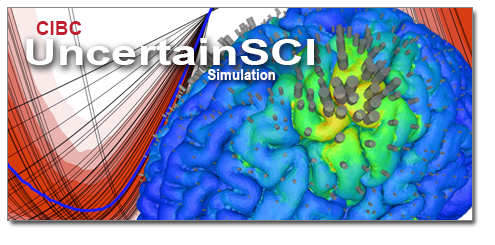

# UncertainSCI

A Python-based toolkit that harnesses modern techniques to estimate model and parametric uncertainty, with a particular emphasis on needs for biomedical simulations and applications. This toolkit enables non-intrusive integration of these techniques with well-established biomedical simulation software.

## Overview

UncertainSCI is an open-source tool designed to make modern uncertainty quantification (UQ) techniques more accessible in biomedical simulation applications.   UncertainSCI uses noninvasive UQ techniques, specifically polynomial Chaos estimation (PCE), with a similarly noninvasive interface to external modeling software that can be called in diverse ways.  PCE and UncertainSCI allows users to propagate the effect of input uncertainty on model results, providing essential context for model stability and confidence needed in many modeling fields.  Users can run UncertainSCI by setting input distributions for a model parameters, setting up PCE, sampling the parameter space, running the samples sets within the target model, and compiling output statistics based on PCE.  This process is breifly describe in the [getting started guide](../user_docs/getting_started.html#quick-guide), and more fully explained in the [API documentation](../api_docs/index.html), and supplied [demos and tutorials](../tutorials/index.html).

## Documentation

<https://uncertainsci.readthedocs.io>

## Getting Started Guide

<https://uncertainsci.readthedocs.io/en/latest/user_docs/getting_started.html>

## License

Distributed under the MIT license. See ``LICENSE`` for more information.

## Publications

- Akil Narayan, Zexin Liu, Jake Bergquist, Chantel Charlebois, Sumientra Rampersad, Lindsay Rupp, Dana Brooks, Dan White, Jess Tate, and Rob S MacLeod. UncertainSCI: Uncertainty quantification for com- putational models in biomedicine and bioengineering. Available at SSRN 4049696, 2022.
- Kyle M. Burk, Akil Narayan, and Joseph A. Orr. Efficient sampling for polynomial chaos-based uncertainty quantification and sensitivity analysis using weighted approximate fekete points. International Journal for Numerical Methods in Biomedical Engineering, 36(11):e3395, 2020.
- Jake Bergquist, Brian Zenger, Lindsay Rupp, Akil Narayan, Jess Tate, and Rob MacLeod. Uncertainty quantification in simulations of myocardial ischemia. In Computing in Cardiology, volume 48, September 2021.
- Lindsay C Rupp, Jake A Bergquist, Brian Zenger, Karli Gillette, Akil Narayan, Jess Tate, Gernot Plank, and Rob S. MacLeod. The role of myocardial fiber direction in epicardial activation patterns via uncertainty quantification. In Computing in Cardiology, volume 48, September 2021.
- Lindsay C Rupp, Zexin Liu, Jake A Bergquist, Sumientra Rampersad, Dan White, Jess D Tate, Dana H. Brooks, Akil Narayan, and Rob S. MacLeod. Using uncertainSCI to quantify uncertainty in cardiac simu- lations. In Computing in Cardiology, volume 47, September 2020.
- Jess Tate, Sumientra Rampersad, Chantel Charlebois, Zexin Liu, Jake Bergquist, Dan White, Lindsay Rupp, Dana Brooks, Akil Narayan, and Rob MacLeod. Uncertainty quantification in brain stimulation using uncertainSCI. Brain Stimulation: Basic, Translational, and Clinical Research in Neuromodulation, 14(6):1659–1660, January 2021.
- Jess D. Tate, Wilson W. Good, Nejib Zemzemi, Machteld Boonstra, Peter van Dam, Dana H. Brooks, Akil Narayan, and Rob S. MacLeod. Uncertainty quantification of the effects of segmentation variability in ECGI. In Functional Imaging and Modeling of the Heart, pages 515–522. Springer-Cham, Palo Alto, USA, 2021.
- Jess D Tate, Nejib Zemzemi, Shireen Elhabian, Beáta Ondrusǔvá, Machteld Boonstra, Peter van Dam, Akil Narayan, Dana H Brooks, and Rob S MacLeod. Segmentation uncertainty quantification in cardiac propagation models. In 2022 Computing in Cardiology (CinC), volume 498, pages 1–4, 2022.

## Acknowledgements

This project was supported by grants from the National Institute of Biomedical Imaging and Bioengineering (U24EB029012) from the National Institutes of Health.
