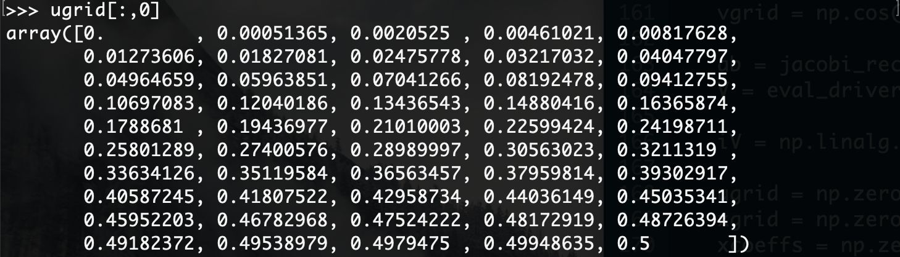
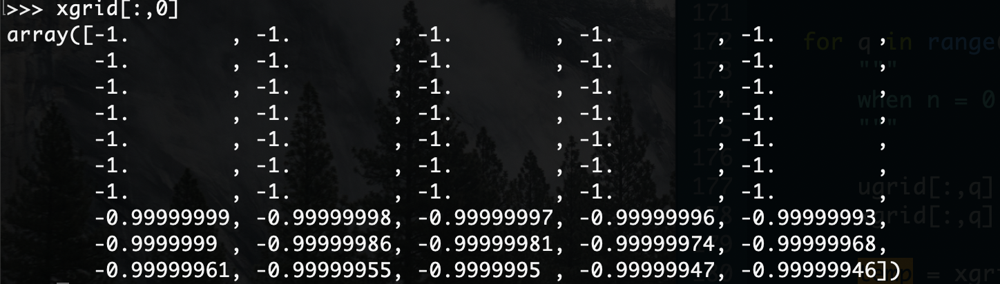
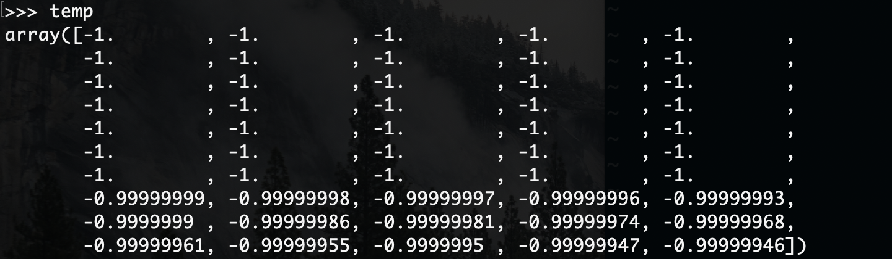
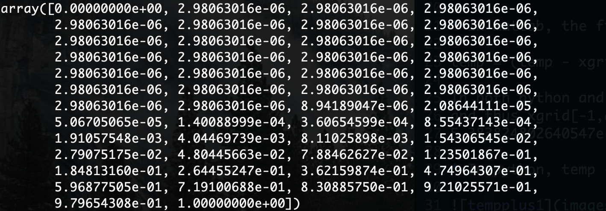
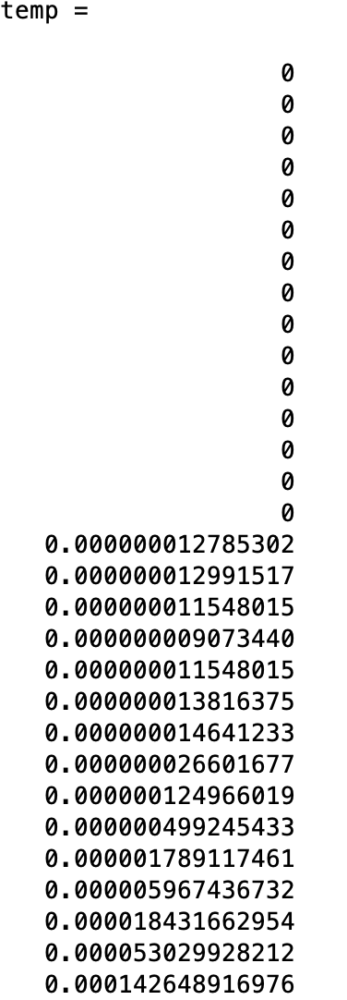
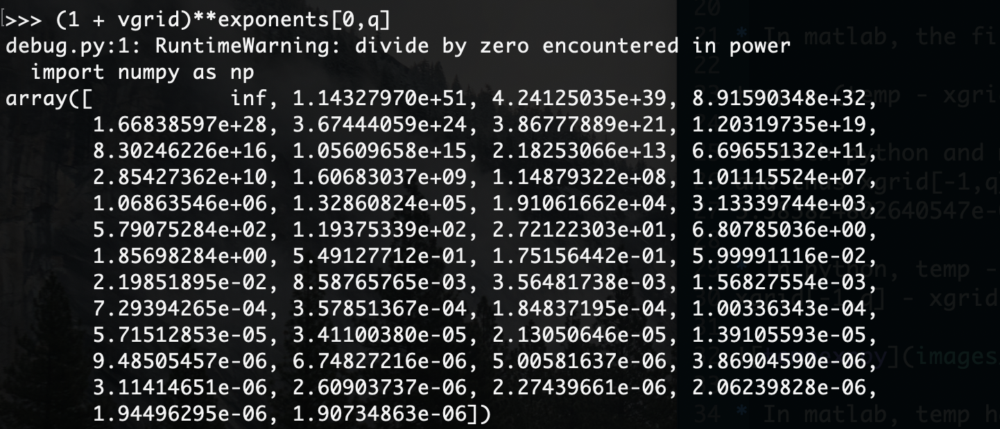
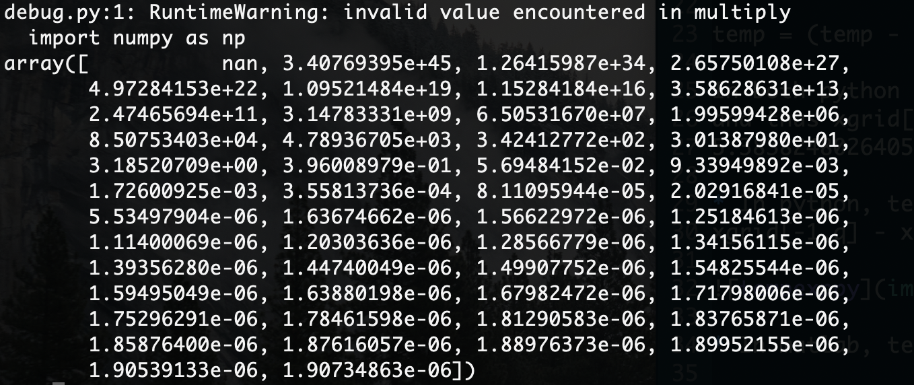
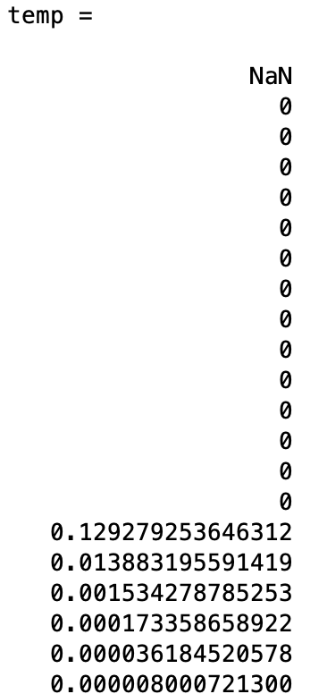

# Case: alpha = 1.5260, beta = -0.9500, n = 0, we focues q = 0 in the iteration

vgrid = np.cos( np.linspace(np.pi, 0, M) ), ug = [0, 0.5, 1.0]

ugrid is computed by ugrid[:,q] = (vgrid + 1) / 2 * (ug[q+1] - ug[q]) + ug[q]

xgrid is computed by xgrid[:,q] = idistinv(ugrid[:,q])

temp is computed by xgrid[:,q]

* In python, only the first element is -1. even though the first 35 elements
displayed in temp is -1. And temp[1] = ... = temp[25] = -0.9999999999983953.
This may cause error when computing xgrid by idistinv.

* In matlab, the first 15 elements are -1.

temp = (temp - xgrid[0,q]) / (xgrid[-1,q] - xgrid[0,q])

In both python and matlab, xgrid[0,q] = -1. and xgrid[-1,q] = -0.999999461617520.
and thus xgrid[-1,q] - xgrid[0,q] = 5.383815753212673e-07 (python) or
5.383824802640547e-07 in matlab.

* In python, temp - (-1.) gives only the first elements zeros and multiply by
xgrid[-1,q] - xgrid[0,q] yields temp

* In matlab, temp has the first 15 elements zeros.

exponents = [[-19, 0], [0, 0.60411718]].  temp = temp * (1 + vgrid)**exponents[0,q].
In both python and matlab, (1 + vgrid)**exponents[0,q] gives

* In python, this will make temp a very big number.

* In matlab, this gives first 15 zeros.

============================================
Fixes
- Formulas exp[0:] = [ beta/(beta+1), alpha/(alpha+1)] are wrong:
  E.g., for alpha = 1.5260, beta = -0.9500, we get exp[0] = -19, but
  empirically we see exp[0] should be -20.
  log(x) ~ 20*log(u) + C
  x ~ K u^20
  - How to fix this?
  - We have x = F_0^{-1}(u)
    I.e., u = F_0(x).
    Q: For x ~ -1, what is behavior of u as a polynomial (power) of (1+x)?
    A: ??? F_0(x) \sim \int_{-1}^{-1+eps} (1+x)^(beta) (1-x)^alpha dx
                  \sim C \int_{-1}^{-1+eps} (1+x)^(beta) dx
                  \sim C/(beta+1) (1+x)^(beta+1) |_{x \in [-1, -1+eps]
                  ....
                  \sim function(eps) = K * eps^power
       So for x ~ -1, then u = F_0(x) \sim (1+x)^power
       Finally: inverse function theorem: near u ~ 0, then 1 + x ~ u^(1/power)
       So F_0^{-1}(u) \sim u^(1/power)
       (Empirically for beta = -0.95, then 1/power = 20)

- Jacobi: For n==0, don't use current idistinv routine, replace with
  scipy.stats.beta.ppf (jacobi.idistinv)

- Revamp the n==0 fast routine behavior (for now, only jacobi)
  - right now: 
    1. compute u, x
    2. rescale u, x so u \in [-1,1], x \in [0,1]
    3. multiply by appropriate endpoint singularities
       x \gets x * (1+u)**a ** (1-u)**b
    4. Form poly approximation of (u, x)
    5. Try this with *current* fidistinv routine but with scipy.stats.beta.ppf
       as idistinv generator. It probably works better. If this works, done.

  - alternative:
    1. compute u, x
    2. rescale u, x so u \in [0,1], x \in [0,1]
    3. compute logu, logx
    4. Rescale so logu \in [-1,1] and logx \in [0, 1]
    5. Form poly approximation of logx vs logu
