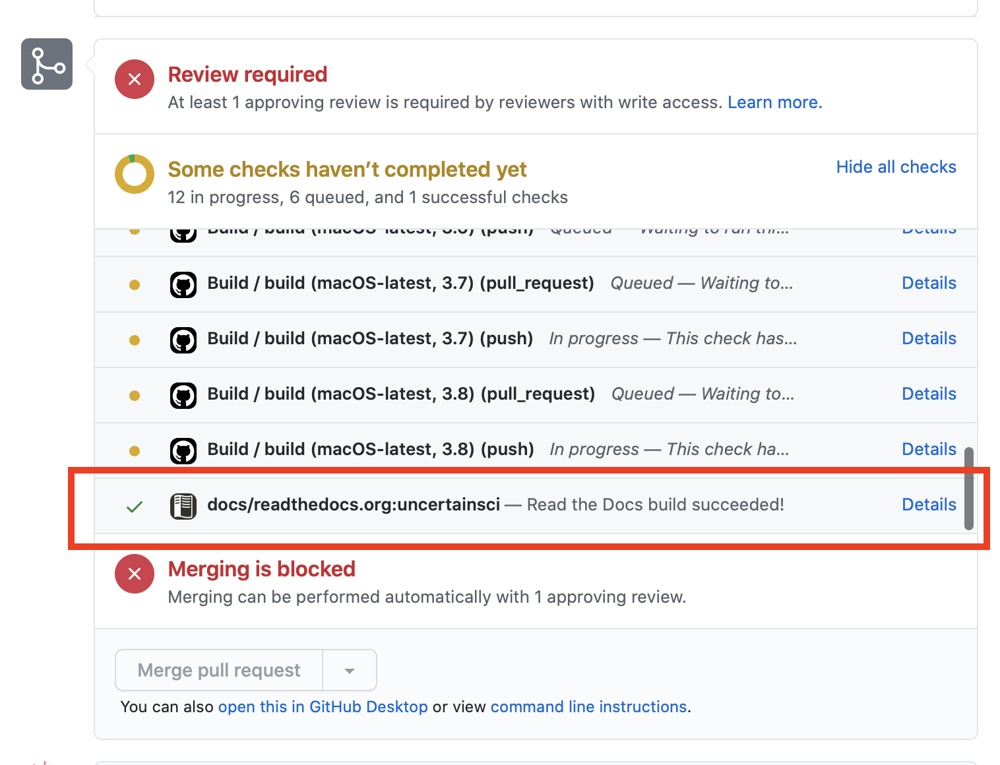

# Making Tutorials

<script type="text/javascript" async
  src="https://cdn.mathjax.org/mathjax/latest/MathJax.js?config=TeX-AMS_CHTML">
</script>
<link rel="stylesheet" href="css/main.css">

This project was supported by grants from the National Institute of Biomedical Imaging and Bioengineering (U24EB029012) from the National Institutes of Health.


Authors:  
Jess Tate 


## Overview

**This tutorial demonstrates how to use markdown to create new tutorials for UncertainSCI.  It will walk through all the files needed and the basic structure needed expected for tutorials.  Knowledge of Markdown, Github, Python, Sphinx, and Read the Docs will be useful. If you have questions, [please ask](https://github.com/SCIInstitute/UncertainSCI/discussions).**

### Software requirements
#### UncertainSCI
To make a Tutorial for UncertainSCI, start with an up-to-date version of the code and documentation.  Download the source code or clone the repository from [github](https://github.com/SCIInstitute/UncertainSCI.git).  We suggest [creating a fork](#creating-your-uncertainsci-fork) of the repository so that you can track your changes and create pull requests to the UncertainSCI repository.  UncertainSCI requirements are found [here](../user_docs/getting_started.html#system-requirements)

#### Dependencies and Development Tools
UncertainSCI uses Read the Docs and Sphinx to build and host tutorial documentation.  This platform converts markdown files to html for web viewing using Sphinx, a Python Library.  Testing the new documentation may require building the web pages locally for viewing.  This will require installing Python, pip, Sphinx, Recommonmark, and other packages in the [`docs/requirements.txt` file](https://github.com/SCIInstitute/UncertainSCI/blob/master/docs/requirements.txt).  More information can be found  in [the walkthorugh]( ) and on the [Sphinx documentation](https://www.sphinx-doc.org).

#### Creating Your UncertainSCI Fork
With your own github account, go to the [UncertainSCI Github page](https://github.com/SCIInstitute/UncertainSCI). Click the fork button on the upper right side of the page. It will ask you where to move the fork to, chose your own account. Once the repository is forked, clone it to your local machine with the following command.  

```
$git clone https://github.com/[yourgithubaccount]/UncertainSCI.git
```

After the the code is cloned, navigate to the repository directory and add the upstream path to the original UncertainSCI repository.  

```
$git remote add upstream https://github.com/SCIInstitute/UncertainSCI.git
```

You should be able to see both your and the original repositories when you use the command:     

```
$git remote -v
```

The fork is good to go, but you will need to sync the fork occasionally to keep up with the changes in the main repository.  To sync your fork, use the following commands:

```
$git fetch upstream

$git checkout master

$git merge upstream/master
```
You should sync and merge your fork before you start a new module and before you create a pull request.  
It is a good practice to create a new branch in your fork for every module you will be adding.  The command to create a new branch is:

```
$git checkout -b [branch_name]
```

Please see the [Github help page](https://help.github.com) for more information.


## Files Needed for a New Tutorial

**This chapter will describe the files need to create a Tutorial for UncertainSCI.**

### Overview of Files Needed for a Tutorial
To make a new tutorial, a markdown file is required for the content of the tutorial.  Other files, such as images, may also be included.  In addition to the new files for the tutorial, a link to the new tutorial should be added to the *User Documents* file.  

### Markdown File
The main file needed for a new tutorial is a markdown file.  The file should have an file ending of *.md* and should be located in the `UncertainSCI/docs/tutorials/` directory.  There is a [template file](https://github.com/SCIInstitute/UncertainSCI/blob/master/docs/tutorials/template.md) that can be used, or an existing tutorial like this one can be used. 

If using math equations in a latex, a call to the mathjax server is required at the begining of the document:
```
<script type="text/javascript" async
  src="https://cdn.mathjax.org/mathjax/latest/MathJax.js?config=TeX-AMS_CHTML">
</script>
```

Sphinx will build the menu and table of contents from the header names, and the document will be formated correctly if the proper markdown headings levels are used.  For instance, the Document title should be the first content:
```
# Title
```
Then the chaper headings:
```
## Overview
## Chapter The First
## ETC.
```

An important part of the document is to acknowledge the authors and funding sources.  Include text similar to this after the document title:
```
This project was supported by grants from the National Institute of Biomedical Imaging and Bioengineering (U24EB029012) from the National Institutes of Health.

Authors:  
Smart people here
```

Chapters and sections will appear in the table of contents with the page titles.   Once the file is [added to the `docs/tutorial/index.rst` file](#linking-to-new-tutorial)

### Added Figures

Most tutorials require a number of screenshots and other images.  Figures and images should be added in a folder for each tutorial in the  `UncertainSCI/docs/user_docs/` folder. The figure folder should be named after the tutorial, for example, the images in this tutorial are in a folder called `HowToTutorial_figures`.  Instructions on how to use the images and figures are found [here](#figures)

### Additional Files
Additional files added to the `tutorials` folder should be minimized as much as possible.  Example scripts should be located in the `UncertainSCI/examples` directory and example data will, generally, need separate hosting. However, if one or two files are needed, they may be added to the  `UncertainSCI/docs/tutorials/` with a consistent naming scheme.  Bibtex file with a matching name should be added in  `UncertainSCI/docs/tutorials/`, yet if multiple additional files are needed, they should placed in a new folder indicating the tutorial: `UncertainSCI/docs/tutorials/[tutorial name]_files`.  

### Linking to New Tutorial

For the new tutorial to be visible on the [tutorials page](../tutorials/index.html#tutorials), add the filename to the list in the  [`UncertainSCI/docs/tutorials/index.rst` file](https://github.com/SCIInstitute/UncertainSCI/blob/master/docs/tutorials/index.rst).  

## Testing Documentation

**This chapter describes how to test the look and content of the new tutorial.  Test the  generated github-pages with either a local Sphinx build or using the online build on Read the Docs.**

### Testing Locally
Testing the documentation locally involves building documentation website on your local machine using Sphinx and Recommonmark.  These instructions are adapted from [Read the Docs' help page](https://docs.readthedocs.io/en/stable/intro/getting-started-with-sphinx.html).

#### Installing Shpinx
To install the Sphinx, make sure that a relatively recent version of Python 3. Installing sphinx and other dependencies is easiest with [pip](https://pip.pypa.io/en/stable/installing/), just run 
```
pip install -r requirements.txt
```
in the `UncertainSCI/docs` folder and the relavent python dependencies, including Sphinx, will be installed.  

Alternatively, the dependencies listed in [`UncertainSCI/docs/requirements.txt` file](https://github.com/SCIInstitute/UncertainSCI/blob/master/docs/requirements.txt) could be installed seperately.  

Please [ask](https://github.com/SCIInstitute/UncertainSCI/discussions) if you have any questions. 

#### Building Documentation

Once the relavent python packages are installed properly, such as with pip, building the documentation pages is as simple as running
```
make html
```
in the `UncertainSCI/docs` folder.   A script will run and, assuming no errors, the html pages will be generated within the `UncertainSCI/docs/_build/` folder.  Any of the html files can be tested by opening it in a browser.  


### Testing Online
In addition to building and testing the documentation pages locally, they can also be tested online with Read the Docs.  Any branch of a github repo can be built one the [Read the Docs page](https://readthedocs.org/projects/uncertainsci/).  Online builds can only be triggered deirectly on the readthe docs by those who have access. However, every pull request to the UncertainSCI repo will trigger an online build that can be viewed by anyone. 

The documentation page can be viewd by clicking on the details link, shown in the image.  [Pull requests](https://docs.github.com/en/github/collaborating-with-issues-and-pull-requests/creating-a-pull-request) are required when submitting contributions to UncertainSCI.

Please [ask](https://github.com/SCIInstitute/UncertainSCI/discussions) if you have any questions. 

## Adding Content

**This chapter provides some examples of how to add some types of content that may be needed for a tutorial.  For general Markdown info, see [here](https://www.markdownguide.org/basic-syntax/) and [here](https://guides.github.com/features/mastering-markdown/).**

### Figures
Figures can be added fairly easily in Markdown, with a simple call to the location:
```

```


However, using a bit of html allows us to <a href="#example">reference the figure</a> easier:
```
<figure id="example">

<figcaption>Example for including an image in tutorial.</figcaption>
</figure>
```
And to reference (not working with Sphinx):
```
<a href="#example">reference the figure</a>
```
<figure id="example">

<figcaption>Example for including an image in tutorial.</figcaption>
</figure>

### Math
Math equations can be used in Markdown using [MathJax](http://docs.mathjax.org/en/latest/basic/mathematics.html).  Mathjax will convert LaTex format:
```
$$ \frac{\partial \rho}{\partial t} + \nabla \cdot \vec{j} = 0 \,. \label{eq:continuity} $$
```
$$ \frac{\partial \rho}{\partial t} + \nabla \cdot \vec{j} = 0 \,. \label{eq:continuity} $$
It can also use MathJax specific tags:
```
\\[ x = {-b \pm \sqrt{b^2-4ac} \over 2a} \\]
```
\\[ x = {-b \pm \sqrt{b^2-4ac} \over 2a} \\]

inline equations use the `\\(\mathbf{p}\\)` sytanx: \\(\mathbf{p}\\) 


### Citations

Since we are using Sphinx to build the documentation, we can use its citation manager, sphinxcontrib-bibtex.  We will provide some exmples here, but for more information, refer to the [sphinxcontrib-bibtex documentation](https://sphinxcontrib-bibtex.readthedocs.io/en/latest/index.html).  

Citations to include in the UncertainSCI docs can be included in the `UncertainSCI/docs/references.bib` file.  For the keys, please use the convention: Initials of the contributor, colon, first three letters of the author (with apropriate capitalization), and the year.  For example `JDT:Bur2020`.  For multiple citations from the same author in the same year, lowercase letters can be appended to the key: `JDT:Bur2020a`.  

After the reference has been added to `UncertainSCI/docs/references.bib`, the final step is to include the command in the appropriate place.  

The sphinxcontrib-bibtex is built to run with rst in Sphinx. However, it can be used in markdown using the [AutoStructify](https://recommonmark.readthedocs.io/en/latest/auto_structify.html) package.  This will require using using an `eval_rst` block as follows:

````
```eval_rst
The whole paragraph will need to be in the eval_rst block :cite:p:`JDT:Bur2020`. For multiple references: :cite:p:`JDT:Bur2020,gupta1983`
```
````

```eval_rst
The whole paragraph will need to be in the eval_rst block :cite:p:`JDT:Bur2020`. For multiple references: :cite:p:`JDT:Bur2020,gupta1983`
```

add a bibliography section
````
```eval_rst
.. bibliography:: ../references.bib
```
````
<!---
TODO: move bibliography section back here when docutils and rtd theme play nicely together

#### Bibliography
```eval_rst
.. bibliography:: ../references.bib
```

-->

### Snippets

Basic markdown ``some snippet``

```
def function():
    return True
```

```python
def function():
    return True
```

### Links
Including links in Markdown is simple, just use `<>` or `[]()`.  For example, an internal link for section [Adding Content](#adding-content) is :
```
[Adding Content](#adding-content)
```
When using internal links to sections, include the name of the section, all lower case and with `-` replacing spaces, and all special characters ommited.  Linking to other pages in within the UncertainSCI documentation requires a relative path.  [Demos](../tutorials/demos.html#demos) is:
```
[Demos](../tutorials/demos.html#demos)
```
Links to other websites can include the full URL.  Using `<>` will show the URL, `[]()` will hide it with other text.  
```
<https://www.markdownguide.org>
[Markdown](https://www.markdownguide.org)
```
<https://www.markdownguide.org>
[Markdown](https://www.markdownguide.org)

### Tables

Tables can be used with normal markdown syntax with the [sphinx-markdown-tables](https://github.com/ryanfox/sphinx-markdown-tables) package

```
| Syntax      | Description |
| ----------- | ----------- |
| Header      | Title       |
| Paragraph   | Text        |
```

| Syntax      | Description |
| ----------- | ----------- |
| Header      | Title       |
| Paragraph   | Text        |


```eval_rst
+------------+------------+-----------+ 
| Header 1   | Header 2   | Header 3  | 
+============+============+===========+ 
| body row 1 | column 2   | column 3  | 
+------------+------------+-----------+ 
| body row 2 | Cells may span columns.| 
+------------+------------+-----------+ 
```


### Referencing Sphinx


To link the UncertainSCI API generated using Sphinx, Use this syntax: [`[text](../api_docs/pce.html#polynomial-chaos-expansions)`](../api_docs/pce.html#polynomial-chaos-expansions).  


## Content Guide

Try to be comprehensive, yet consise, and keep in mind the target audience for the tutorial. It is ok to write an advanced tutorial that builds on more basic knowledge, but please make this expectation clear and link to tutorials and materials that will help the reader develop the required understanding.  Include code snippets, example scripts, screenshots, and videos as appropriate.  Please use [existing tutorials](../tutorials/index.html#Contents) as try to match the style, flow, and level of detail they provide.   

## Supplemental Materials

Some things to consider including with the tutorial.  

### Example Scripts

Example scripts should be located in the  `UncertainSCI/demos/` directory.  Consider using one of the existing demos as a template and try to follow the coding standards outlined in the [contribution guide](contribute.html).  

### Movies

Movies should be stored in a serperate place.  We host most of ours on youtube or vimeo.  

#### Youtube

Get the imbed link from the youtube video.  This can be found by pressing the share button. 

#### Vimeo

Get the imbed link from the vimeo video.  This can be found by pressing the share button.  There are more options if for some users who own the video.  More info [here.](https://vimeo.zendesk.com/hc/en-us/articles/224969968-Embedding-videos-overview)

With the embed link, just include the html into the markdown file.  

```
<iframe title="vimeo-player" src="https://player.vimeo.com/video/279319572" width="640" height="360" frameborder="0" allowfullscreen></iframe>
```

<iframe title="vimeo-player" src="https://player.vimeo.com/video/279319572" width="640" height="360" frameborder="0" allowfullscreen></iframe>


### Datasets

Datasets should be located serperately, unless the size is small.  Please [ask](https://github.com/SCIInstitute/UncertainSCI/discussions) if you have any questions. 

<!--- TODO: see above Bibliography note -->

### Bibliography
```eval_rst
.. bibliography:: ../references.bib
```
