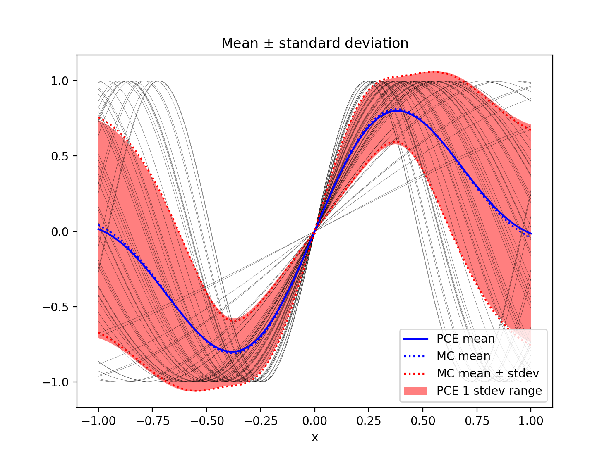
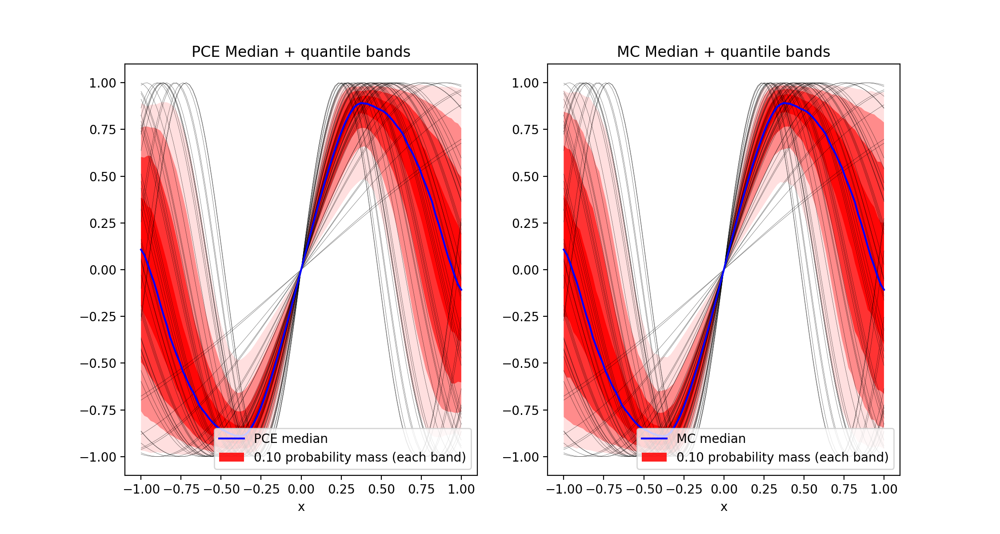
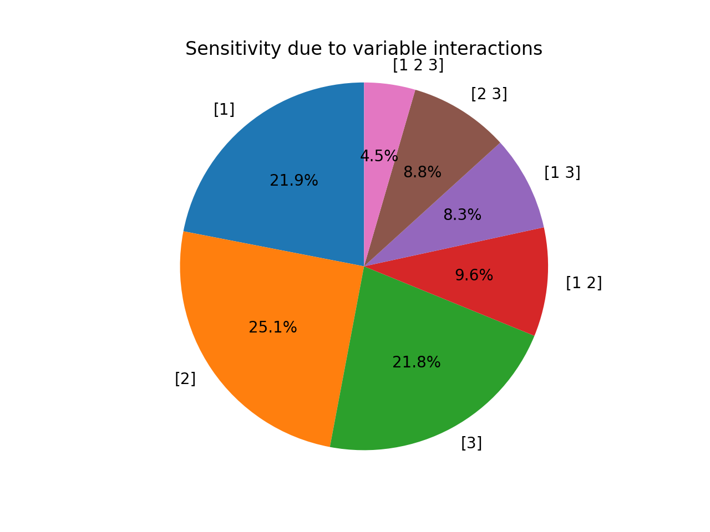

Demos
=====

Building PCE emulators
----------------------

One of the main tools in `UncertainSCI` is the ability to build polynomial Chaos expansions. (See :ref:`pce` for an overview of methodology.) In this first demo, we will investigate the ``demos/build_pce.py`` file and its output. The main goal of this demo is to build a PCE emulator for predicting variation in a model with respect to parameters.

To construct a PCE emulator, one needs to specify both a probability distribution on the parameters, and the expressivity of the PCE model. 

In this example, we define a probability distribution over 3 parameters. We model these parmaeters as independent and uniform, each over the interval :math:`[0,1]`:

.. code-block:: python
    :caption: demos/build_pce.py: Specifying a probability distribution

    # Number of parameters
    dimension = 3

    # Specifies 1D distribution on [0,1] (alpha=beta=1 ---> uniform)
    alpha = 1.
    beta = 1.
    dist = BetaDistribution(alpha=alpha, beta=alpha, dim=dimension)

Here the ``dimension`` indicates that we have 3 random parameters. We have used the ``BetaDistribution`` class to define a Beta probability distribution (see :ref:`distributions`) with ``dimension`` (3) independent variables. Since ``alpha`` and ``beta`` are scalars, they are assumed to apply for each dimension. The values ``alpha=1`` and ``beta=1`` correspond to the uniform density, and the default domain of the Beta distribution is :math:`[0,1]`.

Second, we need to specify the expressivity of the PCE model, which in turns will translate into how much data we'll need to gather from the model. Expressivity is defined by the type of polynomial space; for now, we'll impose a degree-5 total degree space:

.. code-block:: python
    :caption: demos/build_pce.py: Specifying expressivity of the PCE

     order = 5
     indices = TotalDegreeSet(dim=dimension, order=order)

See :ref:`pce` for more about expressivity and polynomial spaces. With the distribution and the expressivity defined, we can instantiate the PCE object:

.. code-block:: python
    
    pce = PolynomialChaosExpansion(indices, dist)

We must now train the PCE on the model. For this simple, example, we take the model defined as

.. math::

    model(x,p) = \sin \left[  \pi ( p_1 + p_2^2 + p_3^3 ) x \right],

where :math:`x` is one-dimensional physical space, and :math:`(p_1, p_2, p_3)` are our three parameters. We create this modeling by specifying the discrete spatial grid over which :math:`x` is defined. Our model is created via

.. code-block:: python
    :caption: demos/build_pce.py: Creating a parameterized model

    N = int(1e2) # Number of degrees of freedom of model
    model = sine_modulation(N=N)

This syntax implicity assumes ``N`` spatial grid points equispaced on the interval :math:`[-1,1]`. The function ``model`` takes as input a length-3 vector representing a parameter value for :math:`(p_1, p_2, p_3)`, and outputs a length-100 vector representing the value of the model output on the ``N`` spatial points at that parameter.

The simplest way to build the PCE emulator is to input the ``model`` to the ``build`` method of the ``pce`` object:

.. code-block:: python
    
    lsq_residuals = pce.build(model)

This call queries the ``model`` several times at different parameter locations, and uses this data to build a PCE emulator. The parameter locations along with the associated model data are accessible via

.. code-block:: python
    :caption: demos/build_pce.py: Accessing parameter locations and data from a built PCE emulator

    parameter_samples = pce.samples
    model_evaluations = pce.model_output

However, the main utility of having a now-built PCE emulator is that statistics (with respect to the parameters :math:`(p_1, p_2, p_3)`) are easily computable. For example, the mean and standard deviation (which are functions of the spatial variable :math:`x`) can be computed as

.. code-block:: python
    :caption: demos/build_pce.py: Computing the mean and standard deviation of a PCE emulator
    
    mean = pce.mean()
    stdev = pce.stdev()

More advanced operations are available. Variance-based sensitivity analysis can provide a means for ranking parameter importance. We can compute the so-called `total sensitivity index`, which measures the importance of each variable on a scale of 0 to 1, and also the `global sensitivity index`, which measures the relative importance that each `subset` of variables has to the overall variance:

.. code-block:: python
    :caption: demos/build_pce.py: Computing sensitivity indices

    # Power set of [0, 1, 2]
    variable_interactions = list(chain.from_iterable(combinations(range(dimension), r) for r in range(1, dimension+1)))

    total_sensitivity = pce.total_sensitivity()
    global_sensitivity = pce.global_sensitivity(variable_interactions) 

Finally, we can also compute quantiles (level sets of the cumulative distribution function) of the model output. 

.. code-block:: python
    :caption: demos/build_pce.py: Computing quantiles and the median

    Q = 4 # Number of quantile bands to plot
    dq = 0.5/(Q+1)
    q_lower = np.arange(dq, 0.5-1e-7, dq)[::-1]
    q_upper = np.arange(0.5 + dq, 1.0-1e-7, dq)
    quantile_levels = np.append(np.concatenate((q_lower, q_upper)), 0.5)

    quantiles = pce.quantile(quantile_levels, M=int(2e3))
    median = quantiles[-1,:]

The remainder of ``build_pce.py`` contains (a) simulations that compare PCE against methods using (much more expensive) Monte Carlo sampling, and (b) for visualizing the output. In particular, the following images are shown by running ``build_pce.py``. **Note**: The procedures are randomized so that the output figures shown here may slightly vary with respect to results generated on a local machine.

    Graphical output from ``demos/build_pce.py`` showing the predicted mean and standard deviation as a function of the spatial variable :math:`x`, along with a comparison against Monte Carlo methods.

    Graphical output from ``demos/build_pce.py`` compared PCE output with medians and quantile bands against results from a more expensive Monte Carlo simulation.

    Graphical output from ``demos/build_pce.py`` showing variance-based global sensitvity indices, measuring the relative importance of subsets of parameters.
