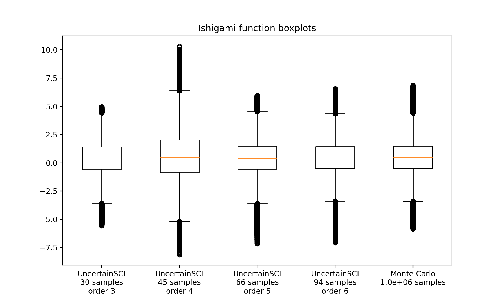

# Simple example with boxplots

<script type="text/javascript" async
  src="https://cdn.mathjax.org/mathjax/latest/MathJax.js?config=TeX-AMS_CHTML">
</script>
<link rel="stylesheet" href="_static/css/main.css">

This project was supported by grants from the National Institute of Biomedical Imaging and Bioengineering (U24EB029012) from the National Institutes of Health.

## Overview

This tutorial demonstrates basic construction of a `PolynomialChaosExpansion` (PCE) emulator, and generates box plots using these emulators. The code used in this document is in the `demos/simple_boxplots.py` demo file.

## Building the emulator

UncertainSCI requires the user to specify 
- a pointer that evaluates a forward model
- distributions for each input parameter to the model
- the polynomial order, which is a PCE expressivity parameter (alternatively, adaptive procedures can automatically select this)

### The forward model

We will use the Ishigami function, a model built into UncertainSCI, as our forward model. The following imports this function 

```python
from UncertainSCI.model_examples import ishigami_function

# Parameters for function
a = 1
b = 0.05

f = ishigami_function(a,b)
```

This generates a function `f` of three parameters. See the [`[Ishigami Function]`](../models.html#ishigami-function) description for more information about this model.

### Parameter distributions

A more complete discussion of creating parameter distributions is given in the [`[Defining Random Parameters]`](../parameters.html) tutorial. Here we only present a simple setup. We will assume that our three parameters,

\begin{align}
\mathbf{P} = (P_1, P_2, P_3) \in \mathbb{R}^3
\end{align}

are each independent and uniform on the interval \\([-\pi, \pi]\\). We set this up in UncertainSCI with the following:

```python
from UncertainSCI.distributions import BetaDistribution, TensorialDistribution

## Set up parameter distributions
bounds = np.reshape(np.array([-np.pi, np.pi]), [2, 1])
p1 = BetaDistribution(alpha=1, beta=1, domain=bounds)
p2 = BetaDistribution(alpha=1, beta=1, domain=bounds)
p3 = BetaDistribution(alpha=1, beta=1, domain=bounds)

p = TensorialDistribution(distributions=[p1, p2, p3])
```

We have used the fact that a `BetaDistribution` with parameters `alpha=beta=1` corresponds to the uniform distribution. See [`[Beta Distribution]`](../parameters.html#beta-distribution) for more information about the Beta distribution. Note also that we have individually defined the parameters, and then combined them into a single three-dimensional random parameter using the `TensorialDistribution` command.

### Defining polynomial order

There are many ways to set polynomial order in UncertainSCI. Here we describe a simple, manual approach. Using the command,
```python
  index_set = TotalDegreeSet(dim=3, order=4)
```
would create an order-4 polynomial space in 3 dimensions (the number of parameters). In this particular demo, we will investigate the effect of increasing the polynomial order. 

### PCE emulators

We will create several PCE emulators, each corresponding to a different PCE order. We accomplish this as follows:

```python
orders = [3, 4, 5, 6]
pces = []

for order in orders:
    index_set = TotalDegreeSet(dim=3, order=order)
    pce = PolynomialChaosExpansion(distribution=p, index_set=index_set)
    pce.build(model=f)
    pces.append(pce)
```

Each PCE object is instantiated by specifying the distribution `p` and the polynomial order via the `index_set` variable. The PCE is built from the model by calling `pce.build(model=f)`. This last command samples the model `f` as many times as needed for the chosen polynomial order. More advanced usage patterns allow finer control over how many samples of `f` are collected. 

Building the PCE, which requires several forward model evaluations, is typically the most computationally costly portion of the pipeline. (In this particular demo it is not since the forward model is very cheap to evaluate.)

## Querying the emulators

The PCE objects are computationally efficient emulators for evaluting `f(p)`. In particular, the following generates a random ensemble for the model output by querying an emulator `pce` at an input ensemble `pvals` for the parameter `p`:

```python
ensembles = []
pvals = p.MC_samples(M=ensemble_size)

ensembles.append(pce.pce_eval(pvals))
```

The number of samples required to build the PCE is relatively small (see the next section). However, the ensemble generated above does not require extra PCE samples from `f` to be generated. Thus, this ensemble sampling is very efficient.

## Boxplots

We generate boxplots using standard Monte Carlo sampling and also sampling from the emulators. For this demo, we use an ensemble of size \\(10^6\\) to generate the boxplot visualizations. We compare the following two approaches.
- PCE emulators built using UncertainSCI with varying polynomial orders each collecting less than 100 forward model samples.
- A Monte Carlo (MC) approach that collects \\(10^6\\) forward model samples.

Boxplots are generated using the `matplotlib` boxplot feature. 



