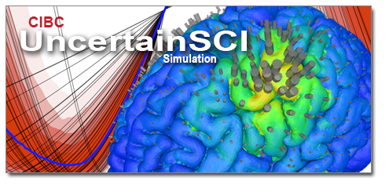

# Template for Tutorial

<link rel="stylesheet" href="_static/css/main.css">

This project was supported by grants from the National Institute of Biomedical Imaging and Bioengineering (U24EB029012) from the National Institutes of Health.

Authors:  
Smart people here


## Overview

** Overview of the document **

### Software Requirements

#### Overview Subsection


## Chapter Name

** Overview text for the Chapter.  In this case there will be examples of several types of content**

### Section
Example section with subsection.  

Use as many paragraphs as needed.  

There are many markdown guides.  Here are some examples:
<https://www.markdownguide.org/basic-syntax/>
<https://guides.github.com/features/mastering-markdown/>

#### Subsection
Example Subsection.  These can go to 6 `#`'s.  Subsections are optional for  table of contents and chapter scope.

### Figures



### Math
Math equations can be written directly in Markdown. MyST-NB and Sphinx handle math rendering during the documentation build.
Example equation:

$$
\frac{\partial \rho}{\partial t} + \nabla \cdot \vec{j} = 0 \,. \label{eq:continuity}
$$

Inline equations use dollar delimiters, as in ``$ a^2 + b^2 = c^2 $``, which displays as $a^2 + b^2 = c^2$.

### Citations

Sphinx has a built in citation manager for bibtex: [sphinxcontrib-bibtex](https://sphinxcontrib-bibtex.readthedocs.io/en/latest/). Use MyST's `eval-rst` directive when a Markdown page needs an rst-only citation directive.

```{eval-rst}
The whole paragraph will need to be in the eval_rst block :cite:p:`JDT:Bur2020`. For multiple references: :cite:p:`JDT:Bur2020,gupta1983`
```


add a bibliography section
````
```{eval-rst}
.. bibliography::
```
````

### Snippets
Inline snippets `like this`.  Muliple lines:
```
# # Define model
N = int(1e2)  # Number of degrees of freedom of model
left = -1.
right = 1.
x = np.linspace(left, right, N)
model = sine_modulation(N=N)
```

### Links

Internal link: [Overview](#overview)

External link: <https://www.markdownguide.org>, or [Markdown](https://www.markdownguide.org)

### Tables

Tables can be used with normal Markdown syntax through MyST.

```
| Syntax      | Description |
| ----------- | ----------- |
| Header      | Title       |
| Paragraph   | Text        |
```

| Syntax      | Description |
| ----------- | ----------- |
| Header      | Title       |
| Paragraph   | Text        |


### Referencing Sphynx


To link the UncertainSCI API generated using Sphinx, use this syntax: [`[text](../api_docs/pce.rst)`](../api_docs/pce.rst)


            
