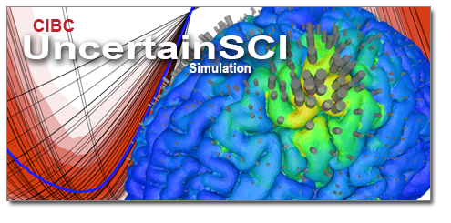

# Template for Tutorial

<script type="text/javascript" async
  src="https://cdn.mathjax.org/mathjax/latest/MathJax.js?config=TeX-AMS_CHTML">
</script>
<link rel="stylesheet" href="_static/css/main.css">

This project was supported by grants from the National Institute of Biomedical Imaging and Bioengineering (U24EB029012) from the National Institutes of Health.

Authors:  
Smart people here


## Overview

** Overview of the document **

### Software Requirements

#### Overview Subsection


## Chapter Name

** Overview text for the Chapter.  In this case there will be examples of several types of content**

### Section
Example section with subsection.  

Use as many paragraphs as needed.  

There are many markdown guides.  Here are some examples:
<https://www.markdownguide.org/basic-syntax/>
<https://guides.github.com/features/mastering-markdown/>

#### Subsection
Example Subsection.  These can go to 6 `#`'s.  Subsections are optional for  table of contents and chapter scope.

### Figures



### Math
Math equations use [MathJax](http://docs.mathjax.org/en/latest/basic/mathematics.html). This requires the inclusion of this near the beginning of the document: 
```
<script type="text/javascript" async
  src="https://cdn.mathjax.org/mathjax/latest/MathJax.js?config=TeX-AMS_CHTML">
</script>
```
Example equation:
\\[ x = {-b \pm \sqrt{b^2-4ac} \over 2a} \\]
$$ \frac{\partial \rho}{\partial t} + \nabla \cdot \vec{j} = 0 \,. \label{eq:continuity} $$

### Citations
Citations in Markdown uses [Pandoc](https://pandoc.org).  

TODO.

### Snippets
Inline snippets `like this`.  Muliple lines:
```
# # Define model
N = int(1e2)  # Number of degrees of freedom of model
left = -1.
right = 1.
x = np.linspace(left, right, N)
model = sine_modulation(N=N)
```

### Links

Internal link: [Overview](#overview)

External link: <https://www.markdownguide.org>, or [Markdown](https://www.markdownguide.org)


### Referencing Sphynx
TODO

To link the UncertainSCI API generated using Sphynx, Use this syntax: [`[text](../api_docs/pce.html#polynomial-chaos-expansions)`](../api_docs/pce.html#polynomial-chaos-expansions)


            
